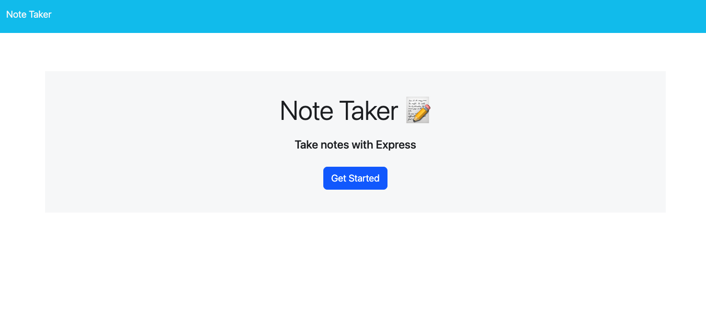
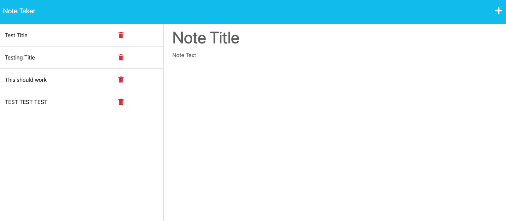

# Easy-Note-Taker

## Description

This application is a simple, dynamic application that allows a user to easily take notes down and save them to a specific database, utilizing a polished front end and relying on express/node.js to create an easy, streamlined back end functionality.
This application also allowed me to showcase my ability to use different query methods when making an api call via our dynamic application. I built this application as a solution to the problem of losing notes taken on a pen and paper. All notes entered are stored on their very own database.

## Table of Contents (Optional)

If your README is long, add a table of contents to make it easy for users to find what they need.

- [Installation](#installation)
- [Usage](#usage)
- [License](#license)

## Installation

In the users' console, firstly run npm i to install the required dependencies. Secondly, run node server.js, in which the user will get a console message stating that the application is listeining on the local server. Which the user will want to navigate to.

## Usage

When the user views this dynamic application they are welcomed with a title screen, and then when they navigate to the notes portion of the web page, all previously saved notes are populated on the left side of the screen, and on the right, there is a text area where the user can then enter a title for a new note, and below they can enter the note itself. When the user clicks the save icon, then that new note will then be added to the list of the existing notes on the left hand side of the page.

    

## License

MIT licensing information can be found in the LICENSE file associated with this repository.